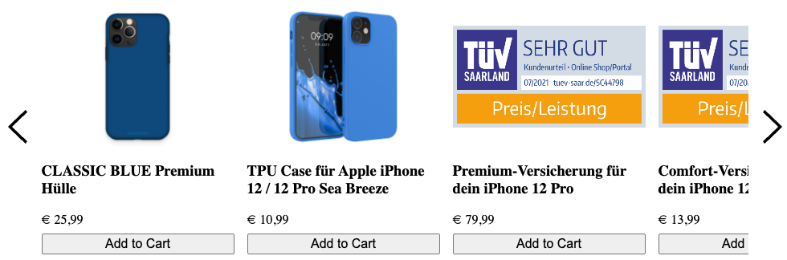

# 35up Recommendations Slider

A slider component with products recommendations.
Just put it in your web shop and connect.

- [Plain web-component variant](packages/slider/README.md).
  
  For plain js frontends (vanilla), Vue.js, Svelte, Lit and others
- [React wrapper](packages/react-slider/README.md).
  
  For React projects

Example look:


## Customize styles

The components is implemented using shadow DOM with all styles isolated,
so there are 3 possibilities for styles customization:
1. Customize host element (`tfup-recommendations-slider`) by directly applying
   styles to it.
2. Customize some specific properties using custom CSS properties. Here
   are the available properties with their default values:
    ```
     --recommendation-height: 25em;
     --color-shimmer: rgba(191, 191, 191, 0.2);
     --color-shimmer-light: rgba(212, 212, 212, 0.1);
     --arrow-size: 3rem;
    ```
   Note: shimmer is a skeleton loading that is shown during request
   execution
3. Use shadow `::part` pseudo-element to customize internal elements. Here is
   the list of available parts: `recommendation`, `button`, `price`, `arrow`

Example:
```
<style>
  tfup-recommendations-slider {
    --recommendation-height: 30rem;
    font-size: 14px;
    color: #333;
  }

  tfup-recommendations-slider::part(recommendation) {
    border-radius: 10px;
    background: #eaf1fb;
    padding: 10px;
  }

  tfup-recommendations-slider::part(button) {
    border-radius: 999px;
    background: #d3e3fd;
  }

  tfup-recommendations-slider::part(button):hover {
    background: #b4cff7;
  }

  tfup-recommendations-slider::part(price) {
    font-weight: bold;
    color: #555;
  }

  tfup-recommendations-slider::part(arrow) {
    color: #d3e3fd;
  }

  tfup-recommendations-slider::part(arrow):hover {
    color: #b4cff7;
  }
</style>
```
